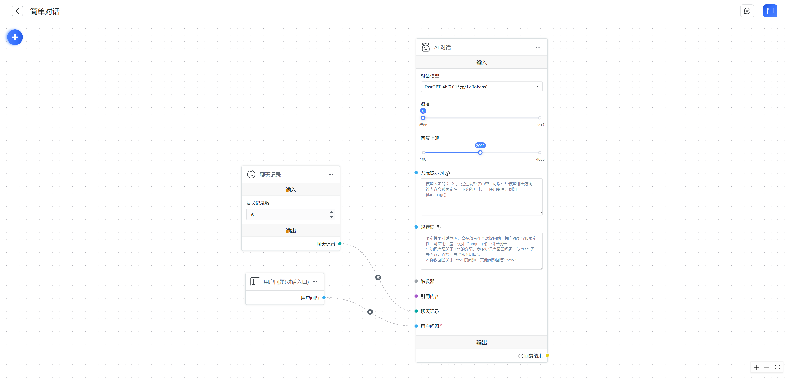
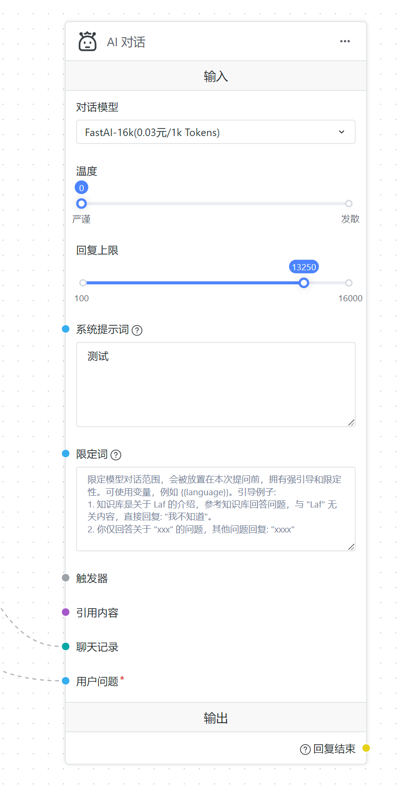
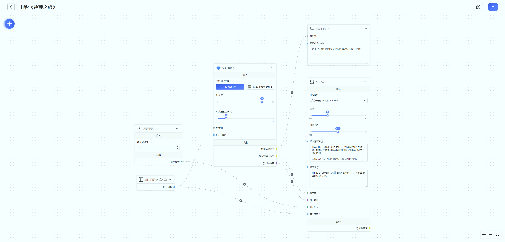

# Quick Start

Starting from FastGpt V4, a new interactive way is introduced to build AI applications. It uses Flow node orchestration to implement complex workflows, improving playability and scalability. However, this also increases the learning curve, and users with some development background may find it easier to use.
This article provides a brief introduction to the basics of module orchestration. Each module will be explained in detail in separate chapters.

## What is a Module?

In programming, a module can be understood as a function or interface. It can be seen as a **step**. By connecting multiple modules together, you can gradually achieve the final AI output.
In the following diagram, we have a simple AI conversation. It consists of a user input question, chat records, and an AI conversation module.

The workflow is as follows:

1. After the user inputs a question, a request is sent to the server with the question, resulting in an output from the "User Question" module.
2. The "Chat Records" module retrieves the number of records from the database based on the set "Max Record Count", resulting in an output.
   After the above two steps, we obtain the results of the two blue dots on the left. The results are injected into the "AI" conversation module on the right.
3. The AI conversation module uses the chat records and user question as inputs to call the conversation API and generate a response. (The conversation result output is hidden by default and will be sent to the client whenever the conversation module is triggered)

### Module Categories

In terms of functionality, modules can be divided into 3 categories:

1. Read-only modules: global variables, user prompts
2. System modules: chat records (no input, directly retrieved from the database), user question (workflow entry)
3. Function modules: knowledge base search, AI conversation, and other remaining modules (these modules have both input and output and can be freely combined)

### Module Components

Each module consists of 3 core parts: fixed parameters, external inputs (represented by a circle on the left), and outputs (represented by a circle on the right).
For read-only modules, you only need to fill in the prompts and they do not participate in the workflow execution.
For system modules, usually only fixed parameters and outputs are present, and the focus is on where the output is directed.
For function modules, all 3 parts are important. Taking the AI conversation module in the following diagram as an example:

The dialogue model, temperature, reply limit, system prompts, and restricted words are fixed parameters. The system prompts and restricted words can also be used as external inputs, which means that if you have an input flow to the system prompts, the originally filled content will be **overwritten**.
The triggers, referenced content, chat records, and user question are external inputs that need to flow in from the outputs of other modules.
The reply end is the output of this module.

### When are Modules Executed?

Remember the principles:

1. Only **connected** external inputs matter, i.e., the circles on the left are connected.
2. Execution is triggered when all connected inputs have values.

#### Example 1:

The chat records module is automatically executed, so the input for chat records is automatically assigned a value. When the user sends a question, the "User Question" module outputs a value, and at this point, the user question input of the "AI Conversation" module is also assigned a value. After both connected inputs have values, the "AI Conversation" module is executed.

#### Example 2:

The following diagram shows an example of a knowledge base search.

1. The chat history flows into the "AI" conversation module.
2. The user's question flows into both the "Knowledge Base Search" and "AI Conversation" modules. Since the triggers and referenced content of the "AI Conversation" module are still empty, it will not be executed at this point.
3. The "Knowledge Base Search" module has only one external input, and it is assigned a value, so it starts executing.
4. When the "Knowledge Base Search" result is empty, the value of "Search Result Not Empty" is empty and will not be output. Therefore, the "AI Conversation" module cannot be executed due to the triggers not being assigned a value. However, "Search Result Empty" has an output and flows to the triggers of the specified reply module, so the "Specified Reply" module outputs a response.
5. When the "Knowledge Base Search" result is not empty, both "Search Result Not Empty" and "Referenced Content" have outputs, which flow into the "AI Conversation" module. At this point, all 4 external inputs of the "AI Conversation" module are assigned values, and it starts executing.
   

## How to Read?

1. It is recommended to read from left to right.
2. Start with the "User Question" module. The user question module represents a user sending a piece of text, triggering the task.
3. Pay attention to the "AI Conversation" and "Specified Reply" modules, as these are the places where the answers are output.
