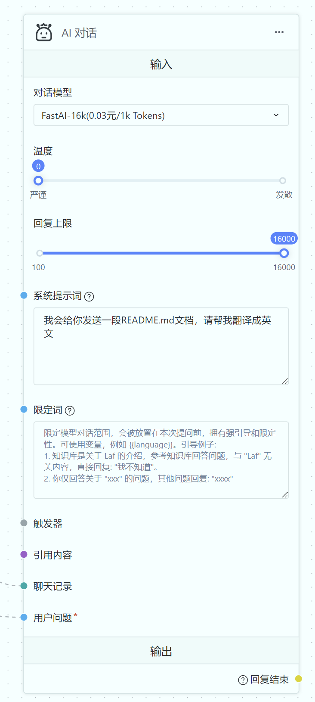

# AI Chat

- Repeatable addition (to prevent messy lines in complex arrangements and make it more visually appealing)
- External input available
- Static configuration available
- Trigger execution
- Core module



## Parameter Description

### Chat Model

You can configure the optional chat models through [data/config.json](/docs/develop/data_config/chat_models) and implement multi-model access through [OneAPI](http://localhost:3000/docs/develop/oneapi).

### Temperature & Reply Limit

Temperature: The lower the temperature, the more precise the answer and the less unnecessary words (tested, but the difference doesn't seem significant).
Reply Limit: Maximum number of reply tokens (only applicable to OpenAI models). Note that this is the reply, not the total tokens.

### System Prompt (can be overridden by external input)

Placed at the beginning of the context array with the role as system, used to guide the model. Refer to the tutorials of various search engines for specific usage~

### Constraint Words (can be overridden by external input)

Similar to system prompts, the role is also system type, but the position is placed before the question, with a stronger guiding effect.

### Quoted Content

Receives an array of external input, mainly generated by the "Knowledge Base Search" module, and can also be imported from external sources through the Http module. The data structure example is as follows:

```ts
type DataType = {
  kb_id?: string;
  id?: string;
  q: string;
  a: string;
  source?: string;
};
// If it is externally imported content, try not to carry kb_id and id
const quoteList: DataType[] = [
  { kb_id: '11', id: '222', q: '你还', a: '哈哈', source: '' },
  { kb_id: '11', id: '333', q: '你还', a: '哈哈', source: '' },
  { kb_id: '11', id: '444', q: '你还', a: '哈哈', source: '' }
];
```

## Complete Context Composition

The data sent to the LLM model in the end is an array, with the content and order as follows:

```
[
    System Prompt
    Quoted Content
    Chat History
    Constraint Words
    Question
]
```
