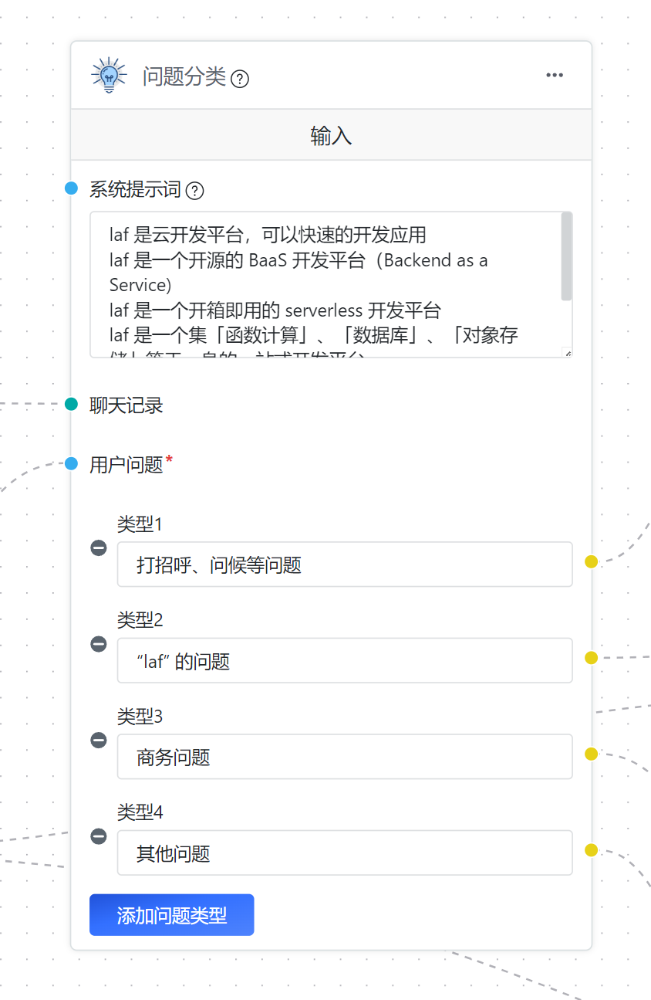

# Problem Classification

- Can be added repeatedly
- Has external input
- Manual configuration
- Trigger execution
- function_call module



## Functionality

It can classify user questions and perform different operations based on the classification. In some ambiguous scenarios, the classification effect may not be very obvious.

## Parameter Description

### System Prompt Words

Placed at the beginning of the conversation, it can be used to supplement the definition of the classification content. For example, questions will be classified into:

1. Greetings
2. Common questions about laf
3. Other questions

Because laf is not a clear concept and needs to be defined, the prompt words can be filled with the definition of laf:

```
laf is a cloud development platform that allows for rapid application development.
laf is an open-source BaaS (Backend as a Service) development platform.
laf is a ready-to-use serverless development platform.
laf is an all-in-one development platform that combines "function computing," "database," "object storage," and more.
laf can be an open-source version of Tencent Cloud Development, Google Firebase, or UniCloud.
```

### Chat Records

Adding some chat records can help with context-based classification.

### User Question

The input content from the user.

### Classification Content

Using the example of these 3 classifications, you can see the final function composition. The return value is randomly generated by the system and does not need to be concerned about.

1. Greetings
2. Common questions about laf
3. Other questions

```js
const agentFunction = {
    name: agentFunName,
    description: 'Determines the type of user question and returns the corresponding enumeration field',
    parameters: {
        type: 'object',
        properties: {
            type: {
                type: 'string',
                description: `Greetings, return: abc; Common questions about laf, return: vvv; Other questions, return: aaa`
                enum: ["abc","vvv","aaa"]
            }
        },
        required: ['type']
    }
};
```

The above function will definitely return one of the values: abc, vvv, or aaa, thereby achieving classification determination.
