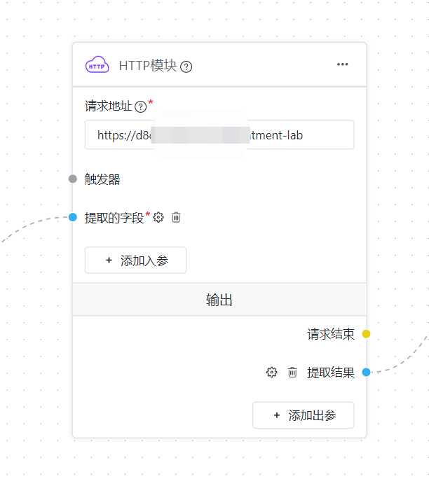

# HTTP Module

- Can be added repeatedly
- Has external input
- Manual configuration
- Trigger execution
- Core module



## Introduction

The HTTP module sends a POST request to the corresponding address, with json parameters in the body. The specific parameters can be customized. It also receives a json response value, with customizable fields. In the above figure, we define an input parameter: extracted field (key is appointment, type is string), and an output parameter: extraction result (key is response, type is string).

So, the curl command for this request is:

```curl
curl --location --request POST 'https://xxxx.laf.dev/appointment-lab' \
--header 'Content-Type: application/json' \
--data-raw '{
"appointment":"{\"name\":\"小明\",\"time\":\"2023/08/16 15:00\",\"labname\":\"子良A323\"}"
}'
```

The response is:

```json
{
  "response": "您已经有一个预约记录了，每人仅能同时预约一个实验室:\n  姓名：小明\n  时间: 2023/08/15 15:00\n  实验室: 子良A323\n      "
}
```

**If you don't want to deploy additional services, you can use laf to quickly build interfaces, write and send them without deployment**

[laf online address](https://laf.dev/)

Here is a request example:

```ts
import cloud from '@lafjs/cloud';
const db = cloud.database();
export default async function (ctx: FunctionContext) {
  const { appointment } = ctx.body;
  const { name, time, labname } = JSON.parse(appointment);
  const missData = [];
  if (!name) missData.push('你的姓名');
  if (!time) missData.push('需要预约的时间');
  if (!labname) missData.push('实验室名称');
  if (missData.length > 0) {
    return {
      response: `请提供: ${missData.join('、')}`
    };
  }
  const { data: record } = await db
    .collection('LabAppointment')
    .where({
      name,
      status: 'unStart'
    })
    .getOne();
  if (record) {
    return {
      response: `您已经有一个预约记录了，每人仅能同时预约一个实验室:
姓名：${record.name}
时间: ${record.time}
实验室: ${record.labname}
`
    };
  }
  await db.collection('LabAppointment').add({
    name,
    time,
    labname,
    status: 'unStart'
  });
  return {
    response: `预约成功。
姓名：${name}
时间: ${time}
实验室: ${labname}
`
  };
}
```

## Purpose

With the HTTP module, you can do unlimited extensions, such as manipulating databases, performing internet searches, sending emails, and so on. If you have interesting use cases, feel free to submit a PR to [Examples](/docs/category/examples)
