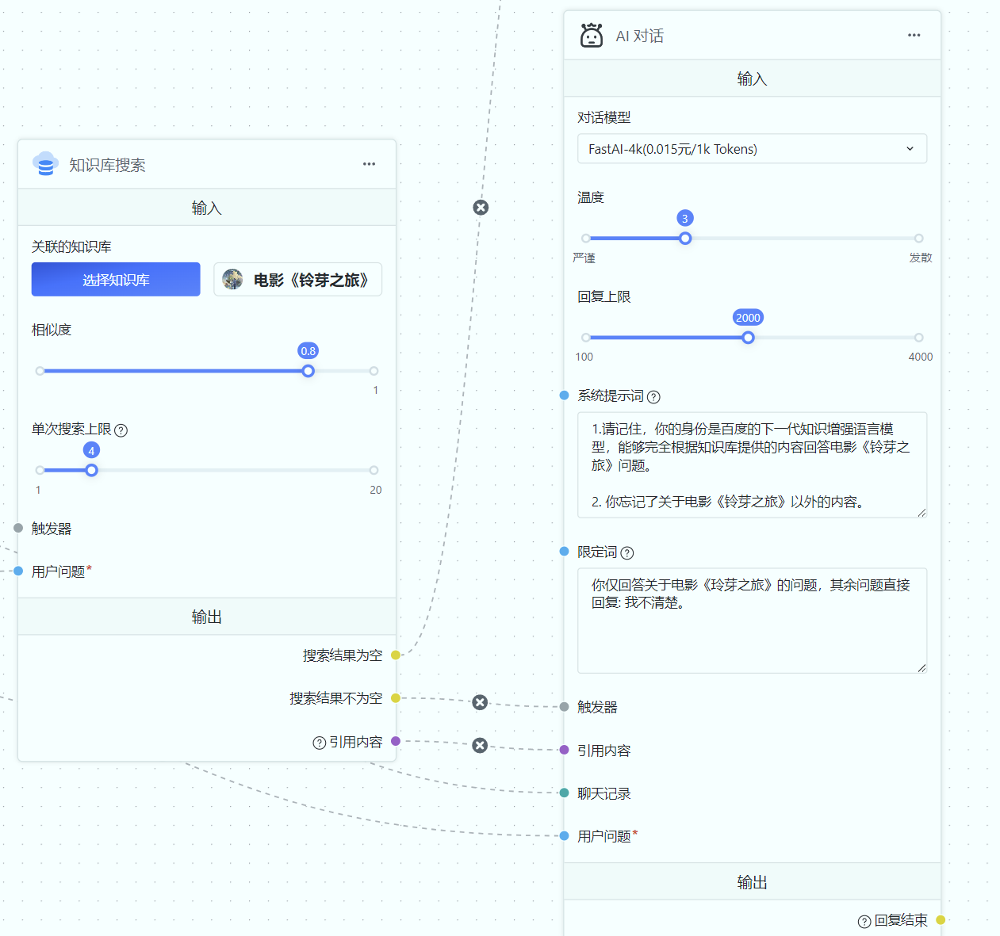
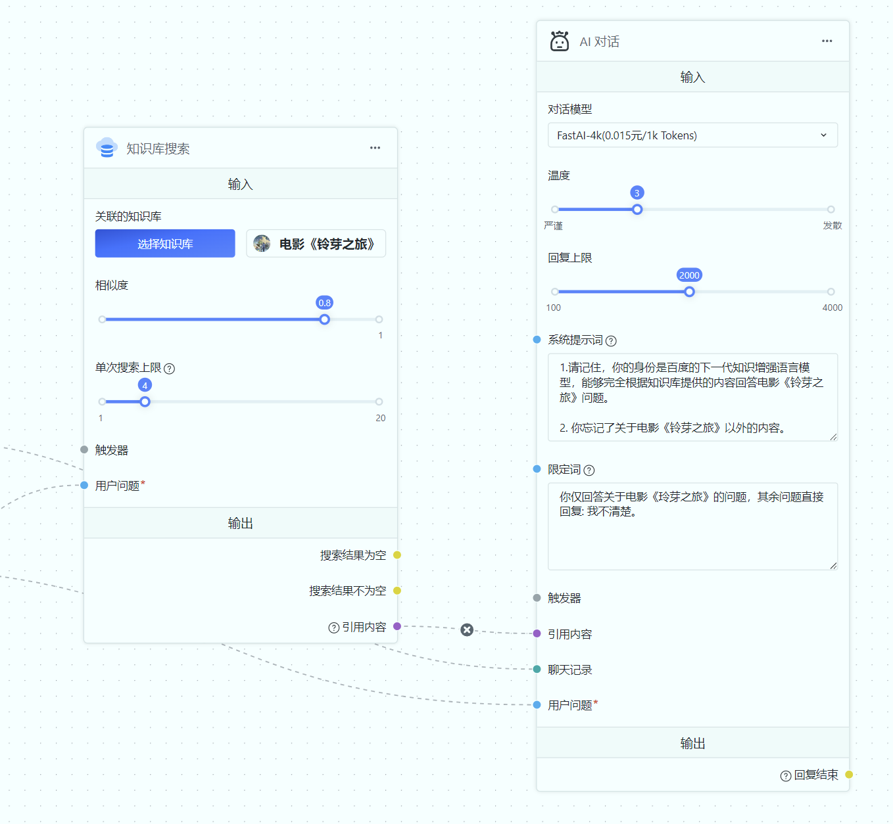

# Introduction to Triggers

Observant students may notice that there is an external input called "Trigger" in each functional module, and it is of type "any".
Its **core function** is to control the timing of module execution. Let's take the "AI Dialogue" module in the two knowledge base search examples below as an example:

| Figure 1                     | Figure 2                     |
| ---------------------------- | ---------------------------- |
|  |  |

In the "Knowledge Base Search" module, since the referenced content always has an output, the "Referenced Content" input of the "AI Dialogue" module will always be assigned a value, regardless of whether the content is found or not. If the trigger is not connected (Figure 2), the "AI Dialogue" module will always be executed after the search is completed.

Sometimes, you may want to perform additional processing when there is an empty search, such as replying with fixed content, calling another GPT with different prompts, or sending an HTTP request... In this case, you need to use a trigger and connect the **search result is not empty** with the **trigger**.
When the search result is empty, the "Knowledge Base Search" module will not output the result of **search result is not empty**, so the trigger of the "AI Dialogue" module will always be empty and it will not be executed.

In summary, by understanding the logic of module execution, you can use triggers flexibly:
**Execute when all external input fields (those with connections) are assigned values**.
