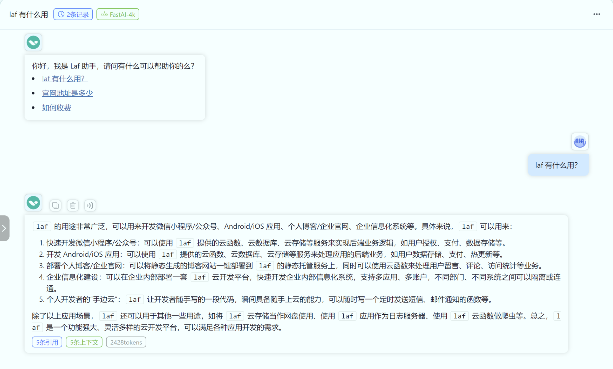
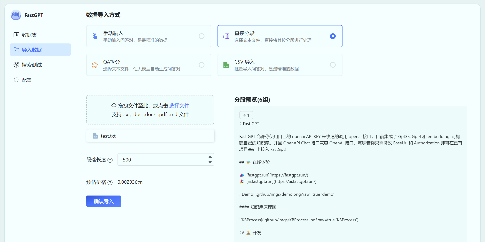
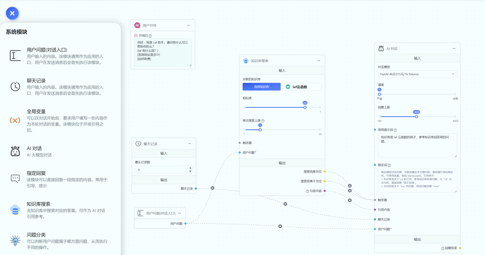
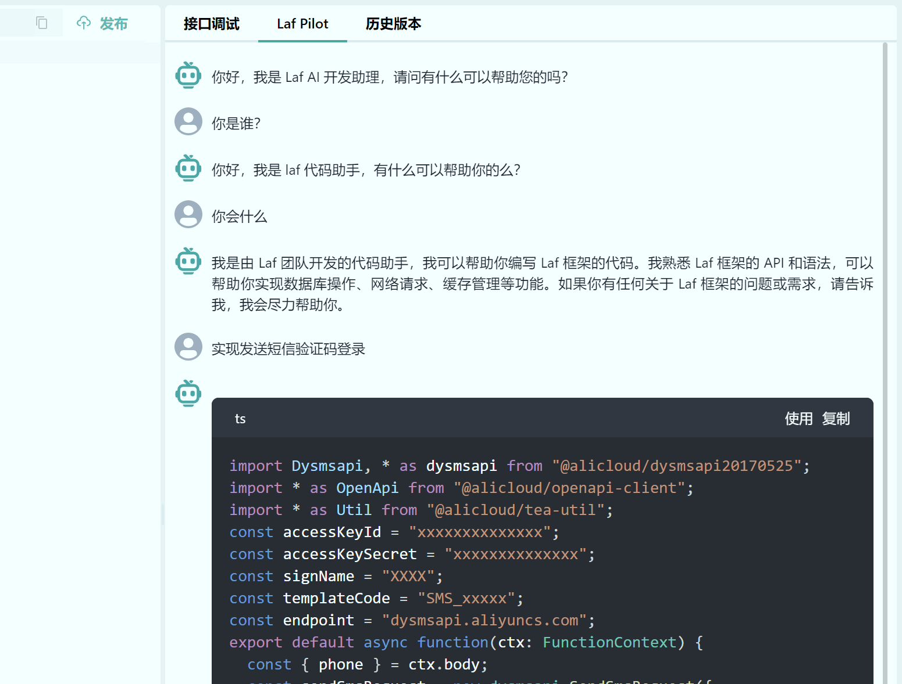

# Introduction to FastGpt

FastGPT is a knowledge-based question-answering system built on top of the LLM language model. It provides out-of-the-box capabilities for data processing, model invocation, and more. Additionally, it offers a visual workflow editor called Flow to enable complex question-answering scenarios!
| | |
| -------------------------- | -------------------------- |
|  |  |
|  |  |

## FastGPT Capabilities

### 1. AI Customer Service

Train the AI model by importing documents or existing question-answer pairs, allowing it to answer questions based on your documents.

### 2. Automated Data Preprocessing

Provides multiple ways to import data, including manual input, direct segmentation, LLM automatic processing, and CSV, to accommodate precise and fast training scenarios.

### 3. Workflow Orchestration

Design more complex question-answering workflows using the Flow module. For example, querying databases, checking inventory, scheduling laboratory appointments, etc.

### 4. Seamless Integration with OpenAPI

FastGPT's API interface aligns with the official GPT API, allowing you to integrate FastGPT into existing GPT applications by simply modifying the BaseURL and Authorization.

## FastGPT Features

1. Open-source project. FastGPT follows the Apache License 2.0 open-source agreement. You can clone FastGPT from GitHub for further development and distribution. The community edition of FastGPT will retain core functionality, while the commercial edition extends it through APIs without affecting learning usage.
2. Unique QA structure. Designed specifically for customer service question-answering scenarios, the QA structure improves accuracy in large-scale data scenarios.
3. Visual workflow. The Flow module displays the complete process from question input to model output, facilitating debugging and designing complex workflows.
4. Infinite scalability. Extensible via HTTP without modifying FastGPT source code, allowing for quick integration into existing programs.
5. Convenient debugging. Provides various debugging methods, such as search testing, reference modification, and complete conversation preview.
6. Support for multiple models: Supports various LLM models such as GPT, Claude, and Wenxin Yiyuan, and will also support custom vector models in the future.

## Core Knowledge Base Process Diagram

